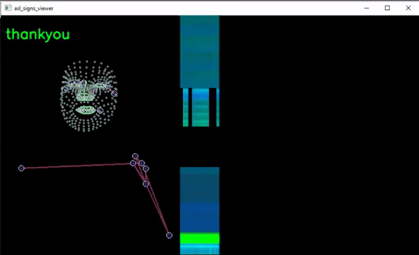

# Overview

Python code for exploration of datasets for ASL recognition.

## Kaggle Datasets

The following datasets are used for this exploration:

| DataSet            | Archive Size | Extracted Size | Kaggle reference                                             | 
| :----------------: | :----------: | :------------: | :----------------------------------------------------------: | 
| asl-signs          |         40GB |           57GB | https://www.kaggle.com/competitions/asl-signs/data           |
| asl-fingerspelling |        170GB |          190GB | https://www.kaggle.com/competitions/asl-fingerspelling/data  |

## Instructions

Perform the following steps to execute on your platform, using tflite as example.

Replace "tflite" with other targets when applicable.

1. Clone repository

    $ git clone https://github.com/AlbertaBeef/aslr_exploration

    $ cd alsr_exploration

2. Download Kaggle datasets (using Kaggle API, or directory from above URLs)

    $ kaggle competitions download -c asl-signs

    $ kaggle competitions download -c asl-fingerspelling

3. Extract Kaggle datasets

    For asl-signs dataset :

    $ mkdir asl-signs
	$ cd asl-signs
	$ unzip ../asl-signs.zip
	$ cd ..

    For asl-fingerspelling dataset :

    $ mkdir asl-fingerspelling
	$ cd asl-fingerspelling
	$ unzip ../asl-fingerspelling.zip
	$ cd ..

4. Launch viewer scripts

    For asl-signs dataset :

    $ python3 asl_signs_viewer.py

    For asl-signs dataset :

    $ python3 asl_signs_viewer.py

    For live video :

    $ python3 mediapipe_holistic_viewer.py

